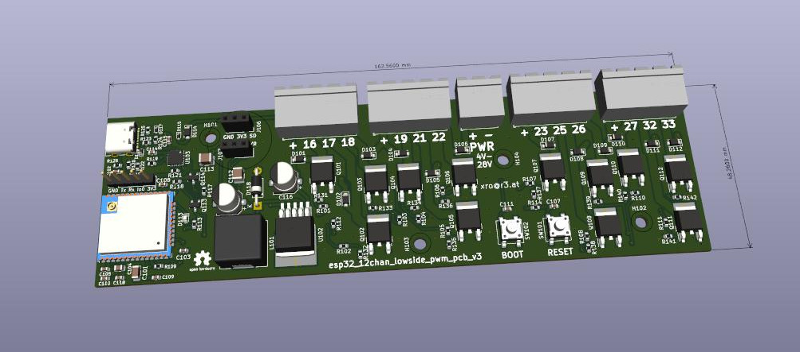

# esp32_12chan_lowside_pwm_pcb

Open Hardware PCB designed to drive 12 low-side PWM channels.

It's designed to work with e.g. WLED firmware and can drive up to 4 RGB LED strips.

You can however use it for whatever you want.
Free-wheeling diodes were added, in case someone wants to use it to drive bigger inductive loads.

[Schematic](renderings/pcb_esp32_wled_pwm_multichannel.pdf)

## Power

### Input

Power by USB for easy flashing.

Or power via screw-terminal: DC from 4V up to 28V.

### Output

The four screw terminals each group VDD as well as 4 GPIO controlled PWM-channels to GND.

- terminal 1: VDD, gpio16, gpio17, gpio18
- terminal 2: VDD, gpio19, gpio21, gpio22
- terminal 3: VDD, gpio23, gpio25, gpio26
- terminal 4: VDD, gpio27, gpio32, gpio33

## Firmware

for easy use, flash WLED-ESP32 and use web-interface to configure
4 "LEDS" as RGB-Strips with GPIO pins listed above.

## Manufacturing

the board was not designed to minimize costs, but for durability.

The folder `esp32_12chan_lowside_pwm_pcb_v2` includes all manufacturing files and information,
so you should easily be able to order your own.

See [fabrication_data.md](esp32_12chan_lowside_pwm_pcb_v2/fabrication_data.md) for specs often asked in order to get a quote.

### Expensive Parts
- the MosFETs
- the choosen ESP32, though you may choose a version with less Flash
- the QFN USB to UART bridge
- the buck regulator

### Costs

- per PCB the parts cost roughly 28 USD
- production+assembly+parts come to roughly 39 USD per PCB

